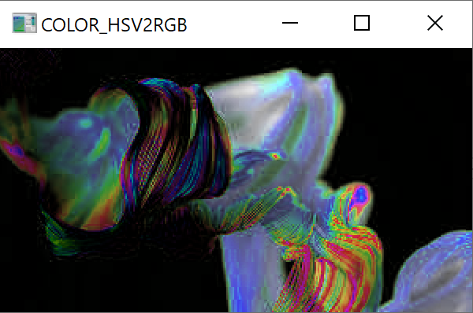

# Color Conversion
## AIM
To perform the color conversion between RGB, BGR, HSV, and YCbCr color models.

## Software Required:
Anaconda - Python 3.7
## Algorithm:
### Step1: 
    Convert BGR and RGB to HSV and GRAY
<br>

### Step2:
    Convert HSV TO RGB AND BGR
<br>

### Step3:
    Convert RGB and BGR to YCrCb
<br>

### Step4:
     To Split and merge RGB Image
<br>

### Step5:
      To Split and merge HSV Image
<br>


## Program:

```python

# Developed By: P.SUGANYA
# Register Number: 212220230049

# i) Convert BGR and RGB to HSV and GRAY
import cv2
goku = cv2.imread('goku.jpg')
modimg1 = cv2.cvtColor(goku,cv2.COLOR_BGR2HSV)
cv2.imshow('COLOR_BGR2HSV',modimg1)
cv2.waitKey(0)
modimg2 = cv2.cvtColor(goku,cv2.COLOR_RGB2HSV)
cv2.imshow('COLOR_RGB2HSV',modimg2)
cv2.waitKey(0)
modimg3 = cv2.cvtColor(goku,cv2.COLOR_RGB2GRAY)
cv2.imshow('RGB2GRAY',modimg3)
cv2.waitKey(0)
modimg4 = cv2.cvtColor(goku,cv2.COLOR_BGR2GRAY)
cv2.imshow('BGR2GRAY',modimg4)
cv2.waitKey(0)


# ii)Convert HSV to RGB and BGR
modimg5 = cv2.cvtColor(goku,cv2.COLOR_HSV2BGR)
cv2.imshow('COLOR_RGB2HSV',modimg5)
cv2.waitKey(0)
modimg6 = cv2.cvtColor(goku,cv2.COLOR_HSV2RGB)
cv2.imshow('COLOR_HSV2RGB',modimg6)
cv2.waitKey(0)


# iii)Convert RGB and BGR to YCrCb
modimg7 = cv2.cvtColor(goku,cv2.COLOR_RGB2YCrCb)
cv2.imshow('RGB2YCrCb',modimg7)
cv2.waitKey(0)
modimg8 = cv2.cvtColor(goku,cv2.COLOR_BGR2YCrCb)
cv2.imshow('RCB2YCrCb',modimg8)
cv2.waitKey(0)


# iv)Split and Merge RGB Image
import cv2
img = cv2.imread("Color.jpeg")
img1= cv2.resize(img, (270,190))
cv2
b,g,r = cv2.split(img1)
cv2.imshow("RED MODEL", r)
cv2.imshow("GREEN MODEL", g)
cv2.imshow("BLUE MODEL ", b)
merger = cv2.merge([b,g,r])
cv2.imshow("MERGED IMAGE", merger )
cv2.waitKey(0)
cv2.destroyAllWindows()


# v) Split and merge HSV Image
hsv_image = cv2.cvtColor(goku, cv2.COLOR_BGR2HSV)
h, s, v = cv2.split(hsv_image)
s.fill(255)
v.fill(255)
hsv_image = cv2.merge([h, s, v])
cv2.imshow('example', hsv_image)
cv2.waitKey()
```
## Output:
### i) BGR and RGB to HSV and GRAY


<br>
<br>

### ii) HSV to RGB and BGR



<br>
<br>

### iii) RGB and BGR to YCrCb


<br>
<br>

### iv) Split and merge RGB Image


<br>
<br>

### v) Split and merge HSV Image


<br>
<br>


## Result:
Thus the color conversion was performed between RGB, HSV and YCbCr color models.
